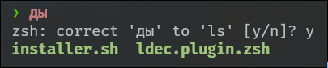

# Layouts Decoder Zsh Plugin



#### an "oh-my-zsh" plugin version of github.com/zenith-chan/Layouts-Decoder repo

## Requirements
```
zsh (github.com/zsh-users/zsh)
oh-my-zsh (github.com/ohmyzsh/ohmyzsh)
```

## Installation
```
sudo chmod +x installer.sh
./installer.sh
exit # Restart terminal
```
## Updates
there will be no updates because this plugin is the most i can do, you can fork this repo and suggest a pull request, if your code works, i'll accept your request
